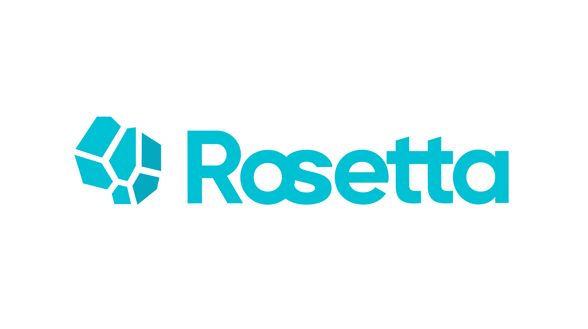

[](https://www.gnu.org/licenses/lgpl-3.0.en.html)

--------------------------------------------------------------------------------

## Overview

Rosetta is a privacy-preserving framework based on [TensorFlow](https://www.tensorflow.org). It integrates with mainstream privacy-preserving computation technologies, inlcuding crypography, federated learning and trusted execution environment. Rosetta aims to provide privacy-preserving solutions for artificial intellegence without requiring expertise in cryptogprahy, federated learning and trusted execution environment. Rosetta reuses the APIs of TensorFlow and allows to transfer traditional TensorFlow codes into a privacy-preserving manner with minimal changes. E.g., just add the following line.

```python
import latticex.rosetta
```
The current version integerates the secure multi-party computation protocols for 3 parties. The underlying protocol is [SecureNN](https://eprint.iacr.org/2018/442.pdf). It is secure in the semi-honest model with honest majority.

## Installation

For now, Rosetta runs on Ubuntu 18.04, and is based on TensorFlow 1.14 with CPUs. Windows is not currently supported.

First, you shoud check that your local system meets our requirement. And then, install the native TensorFlow before building Rosetta from source. After that, you can use an example to check everything runs OK. You can check [Deployment Guide](doc/DEPLOYMENT.md) for the detailed steps of building from source code and installation.


## Usage
The following is a simple example for the famous Millionaires' problem using Rosetta.

```python
import latticex.rosetta as rtt
import tensorflow as tf

#define inputs (from console)
Alice = tf.Variable(rtt.private_console_input(0))
Bob = tf.Variable(rtt.private_console_input(1))

#define computation
res = tf.greater(Alice, Bob)

#run computation
with tf.Session() as sess:
    sess.run(tf.global_variables_initializer())
    res = sess.run(res)
    # reveal the result
    print('ret:', sess.run(rtt.MpcReveal(res))) 
```
For more details, please check [Tutorials](doc/TUTORIALS.md) and [Examples](./example).

## Getting Started

To help you start with your first workable program with Rosetta easily, our [Tutorials](doc/TUTORIALS.md) will lead you to this fantanstic world. In this detailed tutorials, we will assist you learn the basic concepts about Rosetta, then show you how to use the interfaces that we provide by easy-to-understand examples, and finally teach you to build a workable privacy-preserving machine learning model on real datasets.

Hopefully, this tutorial, and more other examples in [Examples](./example), will whet your appetite to dive in knowing more about this privacy-preserving framework.


## Contributing to Rosetta

Rosetta is an open source project developed under the LPGLv3 license and maintained by [LatticeX Foundation](https://latticex.foundation/). Contributions from individuals and organizations are all welcome. Before beginning, please take a look at our [contributing guidelines](CONTRIBUTING.md). You could also open an issue by clicking [here](https://github.com/LatticeX-Foundation/Rosetta/issues/new).

## Documents List

* [Rosetta Tutorials](doc/TUTORIALS.md)

* [Rosetta Deployment Guide](doc/DEPLOYMENT.md)

* [Rosetta MpcOps API](doc/API_DOC.md)

* [Rosetta WhitePaper](doc/Rosetta_whitepaper.pdf)

* [Rosetta Glossary](doc/GLOSSARY.md)

* [Rosetta Release Notes](RELEASE.md)


## Contact

You could reach us by [email](mailto:rosetta@latticex.foundation), and join Rosetta community on [Slack](https://latticexrosetta.slack.com).


## License

The Rosetta library is licensed under the [GNU Lesser General Public License v3.0](COPYING.LESSER).
